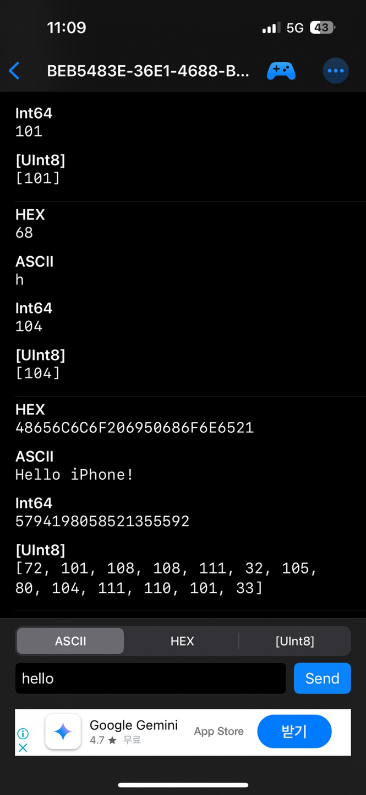

# IoT25-HW04
Assignment 4. ESP32 Bluetooth Classic with Arduino IDE

---

## Result



---

## Note

This assignment originally suggested using Bluetooth Classic (SPP) for communication between the ESP32 and a mobile device. However, since I used an iPhone, I chose to implement the project using Bluetooth Low Energy (BLE) instead.

iOS does not support Bluetooth Classic SPP (Serial Port Profile) for general-purpose apps, which makes it impossible to use the `BluetoothSerial` library with an iPhone. On the other hand, BLE is fully supported by iOS and is the standard for Bluetooth communication on Apple devices.

Therefore, I implemented the same functionality—sending and receiving messages between the ESP32 and the smartphone—using BLE. The ESP32 advertises a BLE service and allows the iPhone to write data to it, which is then displayed on the Serial Monitor.

This approach maintains the purpose of the assignment while ensuring compatibility with the iOS platform.

## Source code
```cpp
#include <BLEDevice.h>
#include <BLEServer.h>
#include <BLEUtils.h>
#include <BLE2902.h>

// BLE Write 콜백 정의
class MyCallbacks: public BLECharacteristicCallbacks {
  void onWrite(BLECharacteristic *pCharacteristic) {
    String value = pCharacteristic->getValue().c_str();  // Arduino String 사용
    if (value.length() > 0) {
      Serial.print("Received from iPhone: ");
      Serial.println(value);
    }
  }
};

BLECharacteristic *pCharacteristic;

#define SERVICE_UUID        "4fafc201-1fb5-459e-8fcc-c5c9c331914b"
#define CHARACTERISTIC_UUID "beb5483e-36e1-4688-b7f5-ea07361b26a8"

void setup() {
  Serial.begin(115200);
  BLEDevice::init("Yeonju-ESP32");

  BLEServer *pServer = BLEDevice::createServer();
  BLEService *pService = pServer->createService(SERVICE_UUID);

  pCharacteristic = pService->createCharacteristic(
                      CHARACTERISTIC_UUID,
                      BLECharacteristic::PROPERTY_READ |
                      BLECharacteristic::PROPERTY_WRITE
                    );

  pCharacteristic->setValue("Hello iPhone!");

  // Write 콜백 등록
  pCharacteristic->setCallbacks(new MyCallbacks());

  pService->start();

  BLEAdvertising *pAdvertising = BLEDevice::getAdvertising();
  pAdvertising->start();
  Serial.println("BLE device is advertising...");
}

void loop() {
  // Nothing here
}
